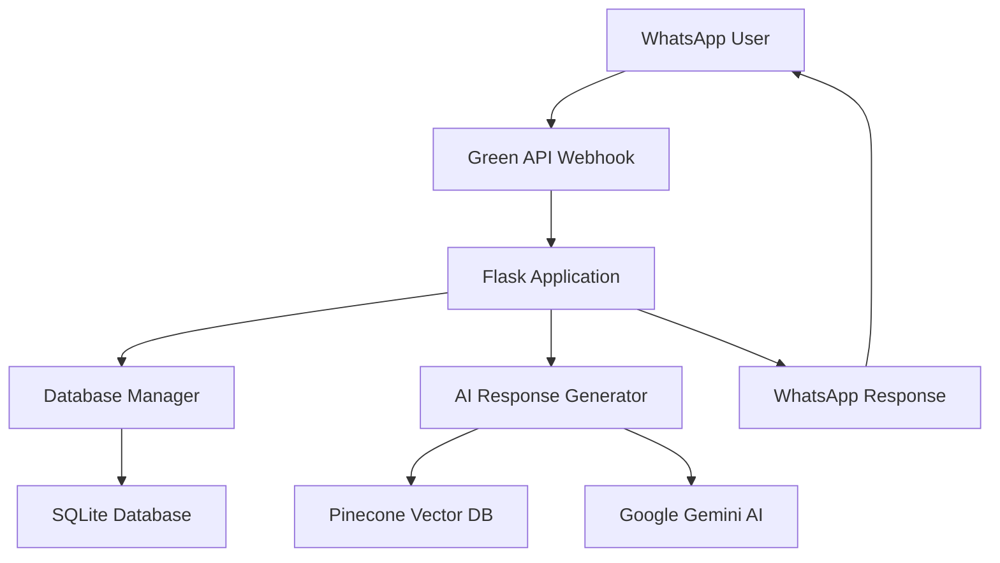

# 🎓 Nigerian Teaching Coach WhatsApp Bot

A sophisticated AI-powered WhatsApp chatbot designed specifically to support Nigerian teachers with classroom management, teaching strategies, student assessment, and professional development. Built with advanced RAG (Retrieval Augmented Generation) capabilities and persistent conversation memory.


## 🌟 Features

### 🤖 **Advanced AI Capabilities**
- **Context-Aware Responses**: Remembers full conversation history for personalized assistance
- **Intent Recognition**: Automatically detects user needs (classroom management, teaching strategies, etc.)
- **RAG Integration**: Retrieves relevant information from a curated knowledge base
- **Multi-turn Conversations**: Maintains context across multiple message exchanges

### 📚 **Teaching Support Areas**
- **Classroom Management**: Strategies for large class sizes and behavioral issues
- **Teaching Methods**: Subject-specific pedagogical approaches
- **Student Assessment**: Evaluation techniques and grading strategies
- **Stress Management**: Teacher wellbeing and burnout prevention
- **Parent Communication**: Effective engagement strategies
- **Curriculum Planning**: Lesson planning and scheme development

### 💾 **Data Management**
- **SQLite Database**: Persistent storage for conversations and user profiles
- **User Analytics**: Track engagement and popular topics
- **Conversation Export**: Download chat histories
- **Data Backup**: Automated database backup functionality

### 🔧 **Administrative Features**
- **User Management**: Reset profiles and manage user data
- **Bulk Messaging**: Send announcements to multiple users
- **Usage Analytics**: Comprehensive reporting and insights
- **Health Monitoring**: System status and performance metrics

## 🏗️ Architecture



## 🛠️ Technology Stack

### Core Technologies
- **Python 3.8+**: Main programming language
- **Flask**: Web framework for webhook handling
- **SQLite**: Local database for conversation storage
- **LangChain**: Framework for AI application development

### AI & ML Services
- **Google Gemini AI**: Advanced language model for response generation
- **Google Embeddings**: Text embedding for semantic search
- **Pinecone**: Vector database for RAG implementation

### Communication
- **Green API**: WhatsApp Business API integration
- **WhatsApp Business**: Message delivery platform

## 📋 Prerequisites

- Python 3.8 or higher
- Active WhatsApp Business account
- Google AI Studio account
- Pinecone account
- Green API account

## 🚀 Quick Start

### 1. Clone the Repository
```bash
git clone https://github.com/your-username/nigerian-teaching-coach-bot.git
cd nigerian-teaching-coach-bot
```

### 2. Install Dependencies
```bash
pip install -r requirements.txt
```

### 3. Set Up Environment Variables
Create a `.env` file in the project root:
```bash
GOOGLE_API_KEY=your_google_api_key_here
PINECONE_API_KEY=your_pinecone_api_key_here
GREEN_API_ID_INSTANCE=your_green_api_instance_id
GREEN_API_TOKEN=your_green_api_access_token
PORT=5000
```

### 4. Initialize the Database
The SQLite database will be automatically created on first run:
```bash
python main.py
```

### 5. Set Up Webhook
Configure your Green API webhook to point to your server:
```
https://your-domain.com/webhook
```

## 🔧 Service Setup Guides

### 📌 **Pinecone Vector Database**

Pinecone is a managed vector database service that enables fast similarity search and retrieval for AI applications.

**What it does:**
- Stores and indexes teaching resources as vector embeddings
- Enables semantic search for relevant information
- Supports real-time retrieval for RAG implementation

**Setup Steps:**
1. Visit [Pinecone Console](https://app.pinecone.io/)
2. Create a free account
3. Create a new index:
   - **Index Name**: `coach`
   - **Dimensions**: `768` (for Google embeddings)
   - **Metric**: `cosine`
   - **Environment**: Choose your preferred region
4. Get your API key from the dashboard
5. Add to your `.env` file

**Useful Links:**
- [Pinecone Documentation](https://docs.pinecone.io/)
- [Pinecone Python Client](https://docs.pinecone.io/docs/python-client)
- [Free Tier Limits](https://www.pinecone.io/pricing/)

### 💚 **Green API (WhatsApp Integration)**

Green API provides WhatsApp Business API access without the complexity of official Meta integration.

**What it does:**
- Enables WhatsApp message sending and receiving
- Provides webhook support for real-time message handling
- Manages WhatsApp Business account integration

**Setup Steps:**
1. Visit [Green API](https://green-api.com/)
2. Create an account and choose a pricing plan
3. Create a new instance:
   - Link your WhatsApp number
   - Get your Instance ID and Access Token
4. Configure webhook URL in the dashboard
5. Set authorization and other required settings

**Configuration:**
```javascript
// Webhook settings in Green API dashboard
Webhook URL: https://your-domain.com/webhook
Webhook Token: (optional, for security)
```

**Useful Links:**
- [Green API Documentation](https://green-api.com/docs/)
- [API Reference](https://green-api.com/docs/api/)
- [Pricing Plans](https://green-api.com/tariffs/)
- [Python SDK](https://github.com/green-api/whatsapp-chatbot-python)

### 🤖 **Google AI Studio (Gemini)**

Google's AI platform providing access to the Gemini language model and embedding services.

**Setup Steps:**
1. Visit [Google AI Studio](https://makersuite.google.com/)
2. Create or sign in to your Google account
3. Create a new API key
4. Enable the Generative AI API
5. Add the API key to your `.env` file

**Useful Links:**
- [Google AI Studio](https://makersuite.google.com/)
- [Gemini API Documentation](https://ai.google.dev/docs)
- [Pricing Information](https://ai.google.dev/pricing)

## 📁 Project Structure

```
nigerian-teaching-coach-bot/
├── main.py                 # Main application file
├── requirements.txt        # Python dependencies
├── .env                   # Environment variables (create this)
├── teaching_coach.db      # SQLite database (auto-generated)
├── teaching_coach.log     # Application logs (auto-generated)
├── README.md             # This file
├── docs/                 # Documentation
│   ├── api-endpoints.md  # API documentation
│   ├── database-schema.md # Database structure
│   └── deployment.md     # Deployment guide
└── scripts/              # Utility scripts
    ├── populate_db.py    # Script to populate knowledge base
    └── backup_db.py      # Database backup utility
```

## 🌐 API Endpoints

### Core Endpoints
- `POST /webhook` - WhatsApp webhook handler
- `GET /` - Health check
- `GET /status` - Bot status and statistics

### User Management
- `GET /user/<chat_id>` - Get user information
- `POST /user/<chat_id>/reset` - Reset user profile
- `GET /export/<chat_id>` - Export conversation history

### Analytics & Admin
- `GET /analytics` - Usage analytics
- `POST /bulk_message` - Send bulk messages
- `GET /database/backup` - Create database backup
- `POST /test` - Test message processing

## 💾 Database Schema

### Users Table
```sql
CREATE TABLE users (
    chat_id TEXT PRIMARY KEY,
    teacher_name TEXT,
    class_taught TEXT,
    phone_number TEXT,
    profile_complete BOOLEAN DEFAULT FALSE,
    first_interaction BOOLEAN DEFAULT TRUE,
    created_at DATETIME DEFAULT CURRENT_TIMESTAMP,
    last_interaction DATETIME DEFAULT CURRENT_TIMESTAMP,
    total_messages INTEGER DEFAULT 0
);
```

### Conversations Table
```sql
CREATE TABLE conversations (
    id INTEGER PRIMARY KEY AUTOINCREMENT,
    chat_id TEXT NOT NULL,
    message_type TEXT NOT NULL CHECK(message_type IN ('user', 'assistant')),
    message_content TEXT NOT NULL,
    timestamp DATETIME DEFAULT CURRENT_TIMESTAMP,
    session_id TEXT,
    message_intent TEXT,
    rag_sources TEXT,
    FOREIGN KEY (chat_id) REFERENCES users (chat_id)
);
```

## 🎯 Usage Examples

### Basic Teacher Interaction
```
Teacher: "My name is Sarah and I teach Primary 3"
Bot: "Hello Sarah! I'm Coach bot, your AI teaching assistant. 
      I see you teach Primary 3. How can I help you today?"

Teacher: "How can I manage 45 students in my class?"
Bot: "Managing a large class of 45 students requires strategic 
      planning, Sarah. Here are proven techniques for Nigerian 
      classrooms..."
```

### Advanced Features
```python
# Test the bot programmatically
import requests

response = requests.post('http://localhost:5000/test', json={
    'chat_id': 'test_user',
    'message': 'How do I handle disruptive students?'
})
print(response.json())
```

## 🚀 Deployment

### Local Development
```bash
python main.py
# Server runs on http://localhost:5000
```

### Production Deployment

#### Using Docker
```dockerfile
FROM python:3.9-slim

WORKDIR /app
COPY requirements.txt .
RUN pip install -r requirements.txt

COPY . .
EXPOSE 5000

CMD ["python", "main.py"]
```

#### Using Heroku
```bash
# Install Heroku CLI
heroku create your-app-name
git push heroku main
heroku config:set GOOGLE_API_KEY=your_key
heroku config:set PINECONE_API_KEY=your_key
# ... set other environment variables
```

#### Using Railway
```bash
# Connect your GitHub repo to Railway
# Set environment variables in Railway dashboard
# Deploy automatically on git push
```

## 📊 Monitoring & Analytics

### Built-in Analytics
- User engagement metrics
- Message volume tracking
- Intent distribution analysis
- Response time monitoring

### Health Monitoring
```bash
# Check bot status
curl http://your-domain.com/status

# Get usage statistics
curl http://your-domain.com/analytics?days=7
```

## 🔒 Security & Privacy

### Data Protection
- All conversations stored locally in SQLite
- No sensitive data transmitted to third parties
- User profiles can be reset on request
- Automatic data cleanup for old conversations

### Security Best Practices
- Environment variables for sensitive keys
- Input validation and sanitization
- Rate limiting on API endpoints
- Secure webhook validation

## 🤝 Contributing

We welcome contributions! Please see our [Contributing Guidelines](CONTRIBUTING.md) for details.

### Development Setup
```bash
# Clone and setup
git clone https://github.com/your-username/nigerian-teaching-coach-bot.git
cd nigerian-teaching-coach-bot

# Create virtual environment
python -m venv venv
source venv/bin/activate  # On Windows: venv\Scripts\activate

# Install dependencies
pip install -r requirements-dev.txt

# Run tests
python -m pytest tests/
```

### Submitting Changes
1. Fork the repository
2. Create a feature branch (`git checkout -b feature/amazing-feature`)
3. Commit your changes (`git commit -m 'Add amazing feature'`)
4. Push to the branch (`git push origin feature/amazing-feature`)
5. Open a Pull Request

## 📝 License

This project is licensed under the MIT License - see the [LICENSE](LICENSE) file for details.

## 🙏 Acknowledgments

- **Nigerian Teachers**: For inspiring this project and providing valuable feedback
- **Google AI**: For providing the Gemini language model
- **Pinecone**: For vector database services
- **Green API**: For WhatsApp integration capabilities
- **Open Source Community**: For the amazing tools and libraries

## 📞 Support

### Getting Help
- 📖 [Documentation](https://github.com/your-username/nigerian-teaching-coach-bot/wiki)
- 🐛 [Issue Tracker](https://github.com/your-username/nigerian-teaching-coach-bot/issues)
- 💬 [Discussions](https://github.com/your-username/nigerian-teaching-coach-bot/discussions)
- 📧 Email: support@yourproject.com

### Common Issues
1. **Database Connection Error**: Ensure SQLite permissions are set correctly
2. **WhatsApp Messages Not Sending**: Check Green API instance status and balance
3. **AI Responses Not Working**: Verify Google API key and quota limits
4. **Vector Search Issues**: Check Pinecone index configuration and API limits

## 🔮 Roadmap

### Short Term (Next Release)
- [ ] Multi-language support (Yoruba, Hausa, Igbo)
- [ ] Voice message support
- [ ] Image sharing for teaching materials
- [ ] Calendar integration for lesson planning

### Long Term
- [ ] Mobile app companion
- [ ] Teacher community features
- [ ] Advanced analytics dashboard
- [ ] Integration with Nigerian curriculum standards

---

**Made with ❤️ for Nigerian Teachers**

*Empowering education through technology*
